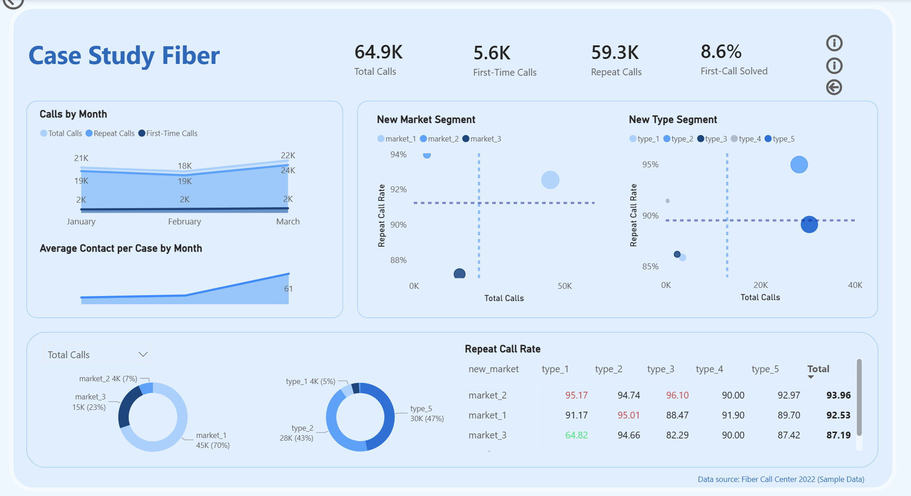

# Power BI Dashboard – Fiber Call Center

Interactive Power BI dashboard published via Power BI Service.

## Live Dashboard

Interactive Power BI dashboard published via Power BI Service:
https://app.powerbi.com/view?r=eyJrIjoiY2YwNzY3ZDUtOTU2OC00NDg2LWJiMWItZjc5OGM5MTA4N2FkIiwidCI6ImE4OTE2ZTg1LTM4ZWYtNDMzOC1hMWMxLTIyMTU4NmY2MDMwNSJ9

**Focus
- Repeat call rate analysis
- Drivers by market and call type
- Monthly call patterns
- First-call resolution

**Files
- `Overview.png` – dashboard preview  
- `PowerBI_Dashboard_Fiber.pdf` – static export

**Tools
Power BI · DAX · Data Modeling · Visual Analytics
